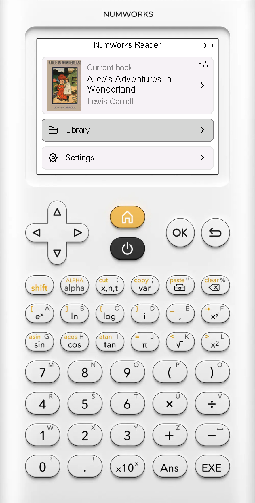
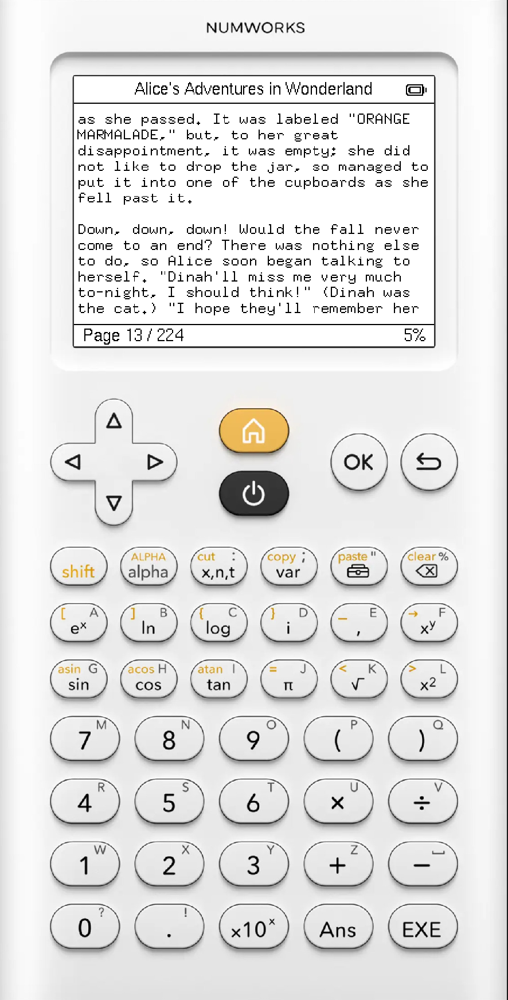

# NumWorks Reader

An EPUB reader for NumWorks calculators, written in Rust.

<p align="center">
  
  
</p>

The reader runs as a `no_std` Epsilon external app. EPUB parsing, image conversion and pagination happen on the
computer. The resulting books are packed into a `.nwlib` file that is loaded by the calculator.

```text
EPUBs -> book-converter -> library.nwlib -> NumWorks Reader
```

## Running

You need Rust and Node.js. NumWorks distributes its external-app tooling through the `nwlink` npm package, so the Cargo
tasks invoke it with `npx` for icon conversion and deployment. `nwlink` does not need to be installed globally.

### Simulator

Set `EPSILON_SIMULATOR` to an Epsilon simulator binary built with external-app support, then pass the EPUBs you want in
the library:

```sh
EPSILON_SIMULATOR=/path/to/epsilon.bin \
    cargo sim books/alice.epub books/frankenstein.epub
```

If `EPSILON_SIMULATOR` is not set, `cargo sim` falls back to `./epsilon.bin`:

```sh
cargo sim books/alice.epub books/frankenstein.epub
```

The supplied EPUBs are converted into a new library before the native version of the reader is built and started in
Epsilon.

### Calculator

Install the ARM Rust target:

```sh
rustup target add thumbv7em-none-eabihf
```

Then connect the calculator over USB and run:

```sh
cargo deploy books/alice.epub books/frankenstein.epub
```

This builds the same library, cross-compiles the application and installs both on the calculator using `nwlink`.

The EPUB arguments describe the complete library for that run: each invocation replaces the previously generated
library.

## Implementation notes

### EADK and `no_std`

The calculator build targets `thumbv7em-none-eabihf` and runs without `std`.

Epsilon external apps interact with the calculator through EADK, a small C API. The wrappers in [`src/eadk/`](src/eadk/)
expose the display, input, timing, battery state and external data to the rest of the application.

There is no heap allocator on the calculator side. Reading state and temporary UI data use fixed-capacity `heapless`
containers, while the book data is borrowed directly from the external data provided by Epsilon.

The simulator runs the same application code as a native build with `std` enabled. A few platform details differ between
the two. Battery information is one example: the EADK battery functions work in the simulator but aren't available on
the calculator, so the device build currently calls the corresponding Epsilon SVCs directly.

### Display

The UI uses `embedded-graphics`, with `u8g2-fonts` for text and `embedded-iconoir` for icons.

[`EadkDisplay`](src/ui/display.rs) implements `DrawTarget<Color = Rgb565>` on top of EADK's display API.

There is no application framebuffer. Pixels are written directly to the 320 x 240 display. Solid rectangles use EADK's
uniform fill operation, while contiguous pixel data is buffered one row at a time and sent with
`eadk_display_push_rect`. Book covers use this path instead of drawing every pixel individually.

The app waits for vertical blanking before drawing a screen to reduce visible tearing.

### Book conversion

EPUB processing happens on the host. `book-converter` extracts the title, author, cover and chapter contents, converts
the cover to RGB565 and paginates the text.

Pagination is done before the book reaches the calculator. The reader doesn't parse XHTML or reflow text while a book is
open; it only looks up and draws the pages produced during conversion.

### Book format

[`book-format`](book-format/) contains the binary format shared by the converter and the calculator. Its parsing side is
`no_std`.

A `.nwlib` contains an offset table followed by its books, and each book contains another offset table for its pages.
`Library`, `Book` and `Page` borrow from the original byte slice, so looking up a page doesn't require copying its
contents or scanning through the preceding pages.

## Current limitations

Reading positions are kept while the application is running but are lost when it exits. Epsilon has persistent storage,
but it isn't exposed to external apps through the public EADK API
([#2](https://github.com/mathias4833/numworks-ereader/issues/2)).

EPUB formatting is mostly flattened to plain text during conversion. Headings, bold and italic text, and footnotes are
not represented properly yet ([#4](https://github.com/mathias4833/numworks-ereader/issues/4)).

Screen updates aren't partial yet. Changing a menu selection or updating the battery indicator can redraw much more of
the display than necessary ([#3](https://github.com/mathias4833/numworks-ereader/issues/3)).

## Repository layout

```text
src/
  eadk/             EADK and platform-specific code
  screens/          home, library and reader screens
  ui/               display adapter, layout and widgets

book-format/        shared NWBK/NWLIB format
book-converter/     EPUB conversion and pagination
xtask/              simulator and deployment tooling
assets/             app icon and default book cover
```